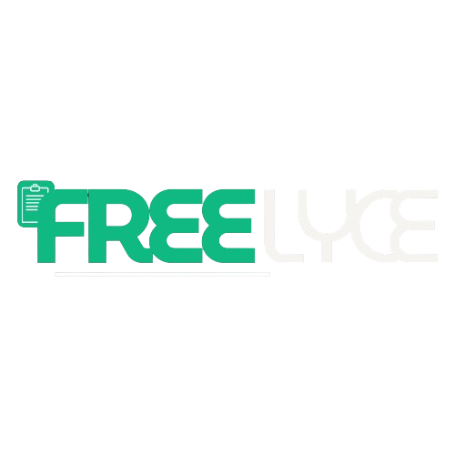

  

  Freelyce adalah aplikasi invoice generator berbasis website yang dirancang untuk freelance, pekerja mandiri, dan pelaku bisnis. aplikasi ini berfokus pada kesederhanaan, kecepatan dan profesionalitas. sebuah aplikasi yang membantu kalian membuat invoice yang rapi dan terpercaya.

Dengan `Freelyce`, pengguna dapat:
- Membuat invoice profesional secara manual dalam hitungan menit.
- Menambahkan item jasa/produk dengan perhitungan otomatis
- Menyimpan invoice menjadi PDF yang bisa di kirim melalui Email.
- Menambahkan catatan status pembayaran (Diproses, Sukses, dan Gagal).